# Analyzing weather data to decide where to open Surf n' Shake shops in Hawaii

We will be assiting an entrepreneur to decide where in Hawaii to open a Surf n' Shake shop and also to provide information to his investor. 
Weather data was analyzed to have a better undestanding about how it could impact the shops. 
The tools used to perform the analysis were Python, Pandas, SQLAlchemy SQLite and Flask.

## Overview

A previous analysis was performed with weather data from Oahu,Hawaii. The provided database has information from 2010 to 2017. Our analyisis was based from August 2016 to August 2017 using python sqlalchemy and flask the results were presented. For this new task we will be analyzing weather data from the months of June and December.

In order to use python while exploring the sqlite db we have to import the sqlalchemy module which allows python to work with several types of db. 
We create an __engine__ that will allows us to "talk" to the db. Then we have to reflect the existing database into a new model creating the Base variable with the __automap_base()__ . Once the database structure was reflected we have to reflect the tables with __Base.prepare()__

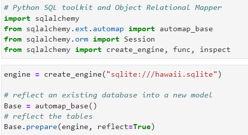

In order for Python to be able to query information from the tables, we have to create classes from those tables and a __session__ variable. Also, the columns were printed to know their names and use them in our queries.

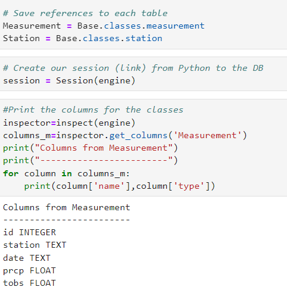

The first task was to determine the summary statistics for June. 
A query was created to obtain the temperatures from this month, then the results were passed to a pandas DataFrame to obtain the statistics from the dataframe. Same task was required for December.

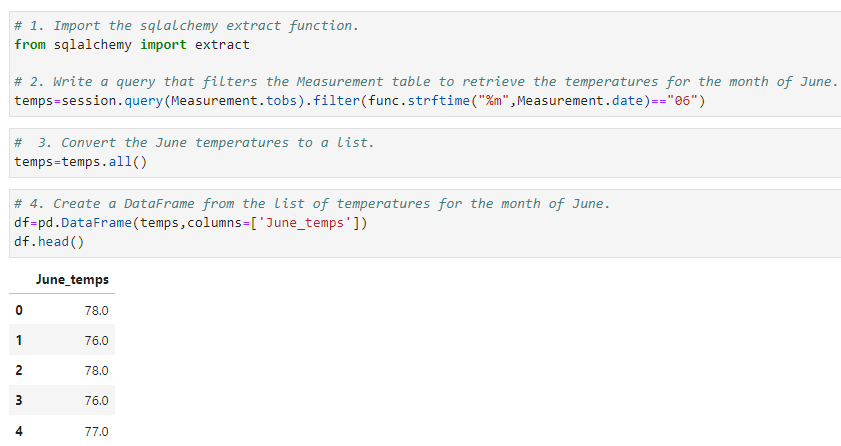

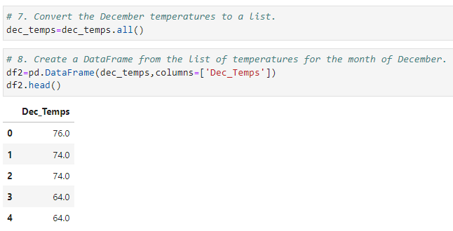

## Results
The statistics for June and Decemeber temperatures are shown below.

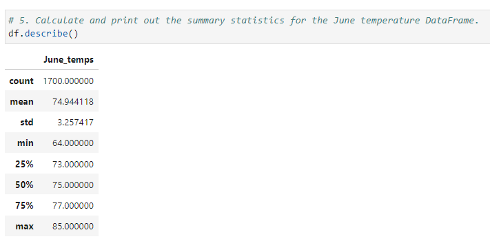

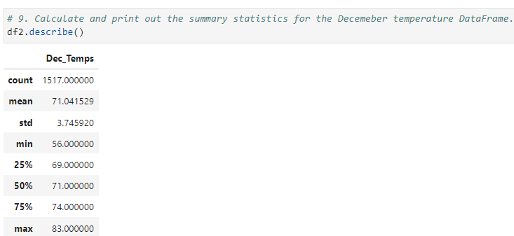

## Summary 

Another query that will help us to obtain more information is the precipitation statistics, the query was performed as follows for June and December.

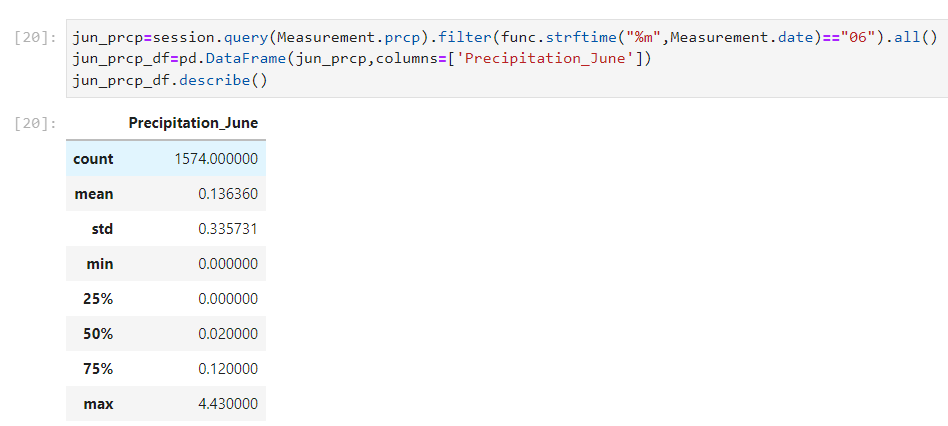

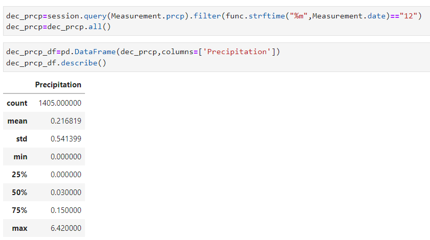

From the results for temperatures and precipitations obtained we can suppose:

* When it rains in June, it rains little and for a shorter time than in December, but it rains more frecuently in June.
* June presents higher temperatures than December.
* Another factor that could influence the consumption of Shake and surf practice are the season of the year. Summer is related to beach and vacations while winter is not. 

### Flask implementation 

With the results obtained from June and December, we can present the results in a web browser with the help of Flask.
We create an instance and then a route for the welcome page, june and december temperatures in python.

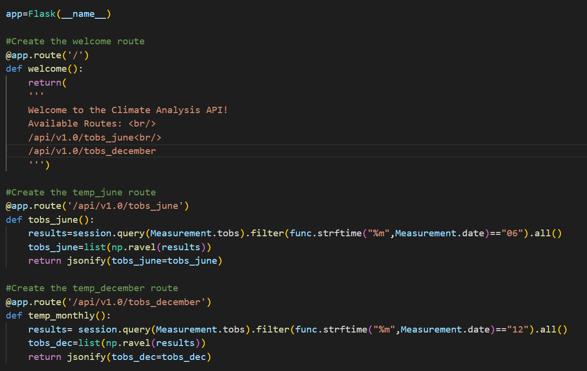

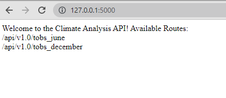

The results are displayed in our browser with the API we created.

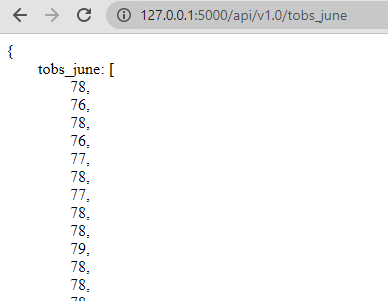

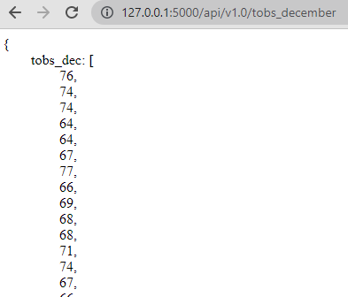

